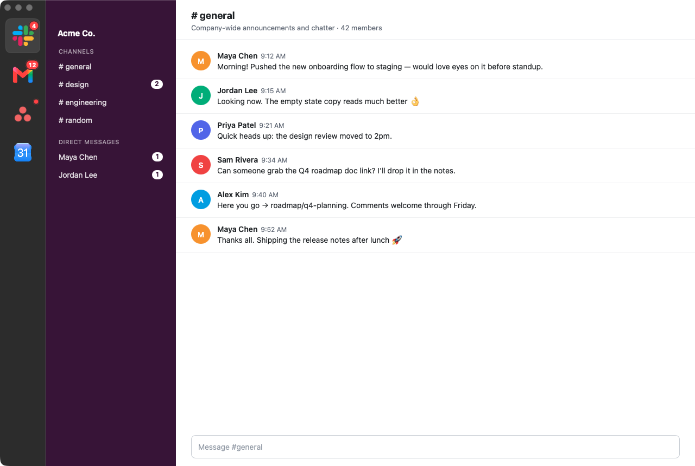
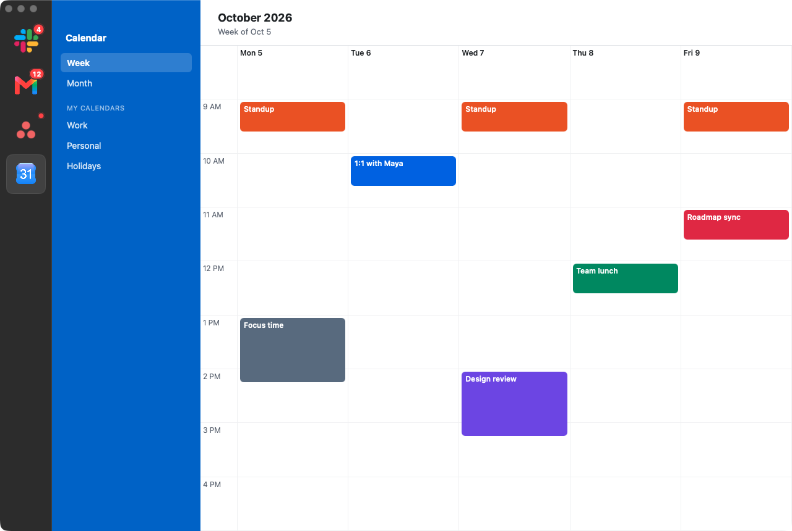

# Switchboard

A minimal wrapper for web apps on macOS, built on the system WebKit (always as current as Safari).





## Build

```bash
./build.sh            # builds build/Switchboard.app
./build.sh --run      # build and launch
./build.sh --install  # build and copy to /Applications
```

## Services

Edit `~/.config/switchboard/services.json` (⌘, in the app). Changes apply within ~2 seconds.

```json
[
  { "name": "Gmail", "url": "https://mail.google.com/mail/u/0/", "profile": "work" },
  { "name": "Asana", "url": "https://app.asana.com", "badge": "document.querySelectorAll('.unread').length" }
]
```

| Field     | Required | Meaning |
|-----------|----------|---------|
| `name`    | yes      | Unique; also the tooltip and menu label. |
| `url`     | yes      | Start page. |
| `profile` | no       | Services sharing a profile share cookies/logins. Use different profiles for multiple accounts on the same site. |
| `icon`    | no       | Image path (`~/…`) or URL. Default: fetched from the site (manifest → apple-touch-icon → favicon). |
| `badge`   | no       | JS expression polled every 3s. Number = count badge, `true` = dot. Default: `(N)` in the page title, the Badging API, or a dot after a notification. |
| `userAgent` | no     | `"chrome"` to pose as the installed Chrome (e.g. for Slack huddles), or a full user-agent string. Default: the installed Safari. |

## Behavior

- Web notifications become macOS notifications; clicking one opens the service and fires the page's `onclick`.
- Dock badge shows the total unread count.
- Links to other sites open in your default browser; sign-in popups (Google, Microsoft, Apple, Okta…) stay in-app.
- ⌘1–9 switch services, ⇧⌘[ / ⇧⌘] cycle, ⌘R reload, ⌘[ / ⌘] back/forward, ⌘= / ⌘- / ⌘0 zoom.
- Closing the window hides it; services keep running. Right-click an icon for reload / open in browser / copy URL.
- Web Inspector: right-click page → Inspect Element.
